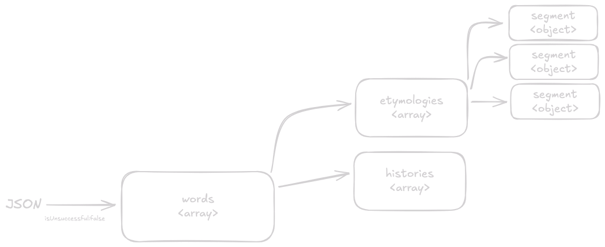
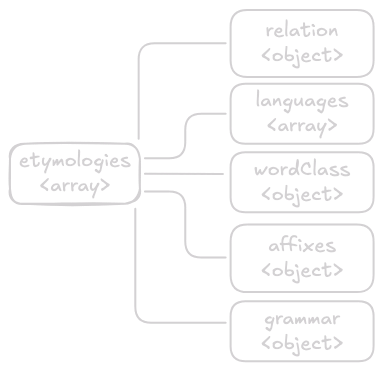

# Parsing Nisanyan API

The API endpoint `https://www.nisanyansozluk.com/api/words/<word>?session=<hexString>`

Where `word` is the the entry to be queries, and `hexString` is a randomized string of hexadecimal characters.

## Basic Response Structure

If the `word` parameters returns a valid response which is marked in the JSON by the property `isUnsuccessful` which is `true` when no words are found and `false` when there is a match.

Examining the JSON further, the `words` array could have multiple object elements inside, each representing a different entry under the same query parameters.

> An Example of this is the word "nar". Where the words array will have a length of 2

Each element inside the words array is an object, The one property that is important is `words[i].name` which is the queriable name and what is shown on the front end.

`words` so also contains properties that are arrays, the most relevant one to our use case is `words.etymologies` which is in itself, an array.

The `words.etymologies` array is where all our logic is going to take place, each element of the `words.etymologies` array is an object which represent a segment or a part of a segment as shown later.



## Segment Structure

Each `word.etymologies` array will contain elements consisting of key:value pairs, objects and nested arrays.

- `etymologies.paranthesis` governs if the segment as a whole is considered a note or not. Query the word "ice tea" for an example.

- `etymologies.originalText` is self-explanatory, could be absent or could be present while having an asterisk "\*" marking it as a reconstructed root, this must be taken into account. Query the word "Alman" for an example.

- `etymologies.romanizedText` This is usually a string, but sometimes it can present itself as two or more words separated by a "/", this must be also taken into consideration as we have to implement logic to parse it correctly. the "/" must be replaced into a " veya " to separate the words.

- `etymologies.definition` Usually, the `definition` contains the acutal definition of the segment, sometimes the `definition` could be `"a.a."` which stands for "aynı anlama gelen" or `"?"` which stands for "anlamı bilinmeyen". Query the word "ileri" for an example.

---

### `etymologies.relation`

This is crucial to understand because this object governs how segment relate to each other, the most important relations to look out for are those with `relation.abbreviation == "§"`, `relation.abbreviation == "+"` and `relation.abbreviation == "/"` as all these make for a joined segment, the "+" will correspond to "ve" and the "/" corresponds with "veya".

Keep in mind that segements do not always parse their own relation, in some cases we will parse `etymologies.grammar` instead.

### `etymologies.languages`

This is an array where each element is an object, not all segments are derived from a single language, so to account for this, we must for loop over the languages array and return the value of `etymologies.languages[i].name`.

### `etymologies.wordClass`

This is also a very crucial point in the parse, this is what defines the linguistic type of the word in each segment, the logic that I have seen is that the `segment[0]` will use its own word class, while `segment[i>0]` will use the `wordClass` of the previous segment.



## Output Structure

The basic structure of the output is the outcome of a for loop that goes through the root.etymologies array.

```js
`${firstSegment}. ${secondSegment}. ${thirdSegment}. ${nthSegment}`;
```

Below is an exmaple of a typical word definition on the website. (added \n for readability)

> Fransızca anxiété “sıkıntı, endişe, sebepsiz korku” sözcüğünden alıntıdır.
>
> Bu sözcük Latince aynı anlama gelen anxietas sözcüğünden alıntıdır.
>
> Bu sözcük Latince angere, anx- “sıkmak, daraltmak, boğmak” fiilinden +itas ekiyle türetilmiştir.

{Fransızca anxiété “sıkıntı, endişe, sebepsiz korku” sözcüğünden alıntıdır.} => firstSegment

{Bu sözcük Latince aynı anlama gelen anxietas sözcüğünden alıntıdır.} => secondSegment

{Bu sözcük Latince angere, anx- “sıkmak, daraltmak, boğmak” fiilinden +itas ekiyle türetilmiştir.} => thirdSegment

From examining multiple words, it looks like the nthSegment explains the n-1Segment, assuming first segment is the main entry, secondSegment explains the first, the third explains the second. etc...

## What are the components of a regular segment?

The code block below represents the most basic segment structure, most of the time the first segment - from the test units I have seen - attempts to preserve this structure, while n>1 segments show lots of variations depending on the response json.

Example word: cesur

**Köken**:

```text
1- [nSegment.originalLanguage] => (Arapça)
2- [(if nSegment.grammar.semiticRoot else return) "kokunden gelen"] => (csr kökünden gelen)
3- [nSegment.romanizedText (if exists)] => (casūr)
4- [nSgement.originalText] => (جسور)
5- [nSegment.definition] => (girişken, gözüpek, atak")
6- [nSegment.wordClass](Vowel harmony rules) => (sözcük)
7- [nSegment.relation"dir"]. => (ünden alıntıdır)
```

Full parse must be [Arapça csr kökünden gelen casūr جسور “girişken, gözüpek, atak” sözcüğünden alıntıdır.]

### The Logic

With words that have multiple segments, the general flow is that the n+1Segment is related to nSegment so access to the previous (and sometimes next) segments' data is necessary.

```text
if (nSegment.grammar.case) {
  (n+1)Segment will use nSegment.grammar.case.definition in component 7
}
if (!nSegment.grammar.case) {
  (n+1)Segment will use (n+1)Segment.relation.text
}
```
